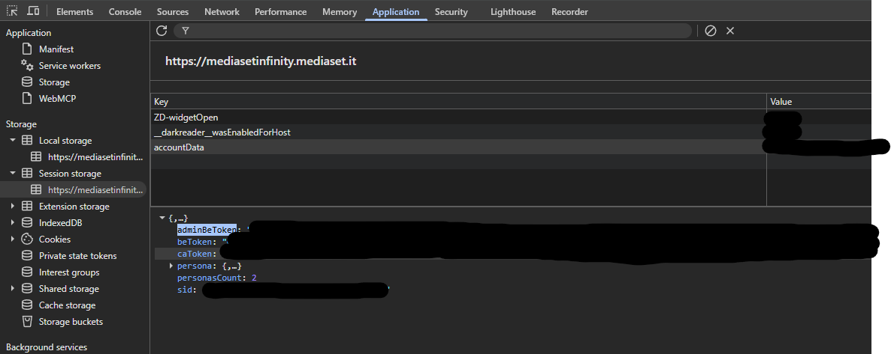
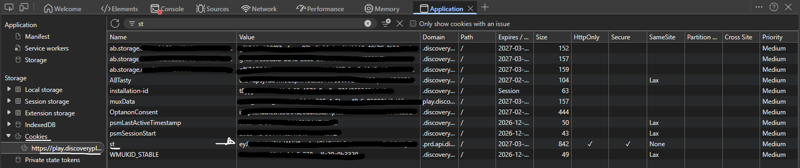

## Crunchyroll: Get Cookies via Extension

### Prerequisites

- Install the [CookieInspector] browser extension from DISCORD

### Steps

1. **Open** [Crunchyroll](https://www.crunchyroll.com/) and **log in** with your credentials.
2. **Click** the CookieInspector extension icon in your browser toolbar.
3. **Click** "Get Cookies" button.
4. **Click** "Copy JSON" to copy the authentication data.
5. Add it to `Conf/login.json`:
   ```json
   "crunchyroll": <paste_copied_json_here>
   ```

---

## Mediaset Infinity

### Steps

1. **Open** [Mediaset](https://mediasetinfinity.mediaset.it/) and **log in**.
2. **Open Developer Tools** (<kbd>F12</kbd>).
3. Navigate to the **Application** tab (or **Storage** in Firefox) → **Session Storage** → select the `mediasetinfinity.mediaset.it` domain.
4. **Find** the `accountData` key.
5. **Copy the value** of the `adminBeToken` field inside it.

### Screenshot Reference


---

## Discovery+ [EU]

### Steps

1. **Open** [Discovery+](https://play.discoveryplus.com/) and **log in**.
2. **Open Developer Tools** (<kbd>F12</kbd>).
3. Navigate to the **Application** tab → **Cookies**.
4. **Search for** `st` cookie.
5. **Copy the value** of the `st` token.

### Screenshot Reference


---

## HBO Max

### Steps

1. **Open** [Hbomax](https://play.hbomax.com/) and **log in**.
2. **Open Developer Tools** (<kbd>F12</kbd>).
3. Navigate to the **Application** tab → **Cookies**.
4. **Search for** `st` cookie.
5. **Copy the value** of the `st` token into `Conf/login.json`:
   ```json
   "hbomax": {
     "st": "your-token"
   }
   ```

---

## Amazon Prime Video [EU]: Get Cookies via Extension

### Prerequisites

- Install the [CookieInspector] browser extension from DISCORD

### Steps

1. **Open** [Prime Video](https://www.primevideo.com/) and **log in**.
2. **Click** the CookieInspector extension icon in your browser toolbar.
3. **Click** "Get Cookies" button.
4. **Click** "Copy JSON" to copy the authentication data.
5. Add it to `Conf/login.json`:
   ```json
   "primevideo": <paste_copied_json_here>
   ```

---

## Tubi TV: Plain Credentials

Unlike the cookie-based services above, Tubi TV authenticates with a plain email/password pair
— no browser extension needed.

### Steps

1. Add your Tubi TV account credentials to `Conf/login.json`:
   ```json
   "tubi": {
     "email": "your@email.com",
     "password": "your-password"
   }
   ```

Without these set, search returns no results for this site.

---

## Apple TV+: Get Cookies via Extension

### Prerequisites

- Install the [CookieInspector] browser extension from DISCORD

### Steps

1. **Open** [Apple TV+](https://tv.apple.com/) and **log in**.
2. **Click** the CookieInspector extension icon in your browser toolbar.
3. **Click** "Get Cookies" button.
4. **Click** "Copy JSON" to copy the authentication data.
5. Add it to `Conf/login.json`:
   ```json
   "appletv": <paste_copied_json_here>
   ```