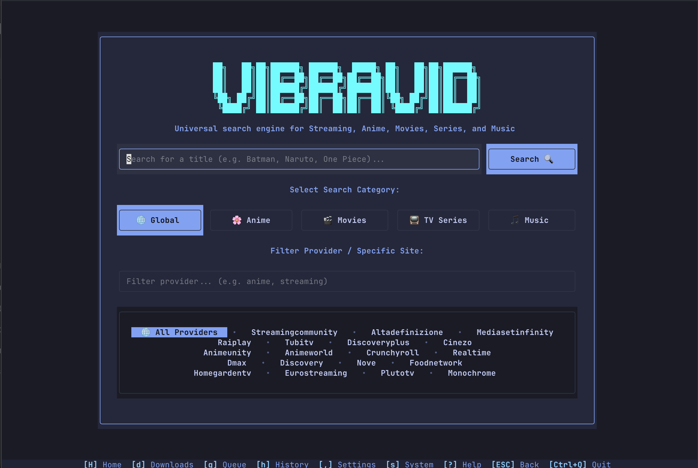

# TUI (Terminal User Interface)

VibraVid includes a modern terminal-based user interface built with [Textual](https://github.com/Textualize/textual), providing a rich, interactive experience for managing downloads directly from the command line without requiring a web browser.

## Launching the TUI

```bash
# Launch via python
python tui.py

# Or via uv package manager
uv run python tui.py

# Or if installed via pip/termux
vibravid --tui
```

## Key Capabilities & Features

- **Global Search Deduplication** — Aggregates search results across all configured streaming and music providers into a single result entry per title, eliminating duplicate search results while showing all available sources.
- **Multi-Provider Detail Navigation** — Triple-column layout in title detail screens (`[Providers] → [Seasons] → [Episodes]`), allowing seamless switching between providers on the fly without returning to search results if episodes are missing.
- **Automatic i18n Localization (IT / EN)** — Automatic OS system language detection (Italian and English) with full bilingual support across all UI screens, data tables, modals, action bars, and keyboard guides.
- **Interactive Queue & Batch Manager** — Add, remove, reorder, and retry batch download jobs with custom CLI arguments and tags.
- **Live Stream & Download Progress Tracking** — Real-time progress indicators, speed, segment counts, track/stream details, and completed file actions (Open Folder / Launch File).
- **System & DRM Inspector** — Diagnostics tab inspecting external binary dependencies (`ffmpeg`, `mp4decrypt`, `aria2c`, etc.), Widevine DRM CDM device status, and application log viewer.
- **Full Keyboard & Mouse Navigation** — Directional arrow key navigation, contextual shortcuts (`a` select all, `u` clear, `Space` toggle, `ESC` back, `?` help), and mouse click support.

## TUI Screen Map

| Shortcut | Screen | Description |
|----------|--------|-------------|
| `F1` / `H` | **Home** | Category selection (Film, Series, Anime, Music) and site filter shortcut cards |
| `F2` | **Search** | Global search with deduplicated results and live metadata preview card |
| `F3` / `d` | **Downloads** | Real-time progress table, track/stream inspector, and completed downloads |
| `F4` / `q` | **Batch Queue** | Enqueue jobs, retry failed items, and manage CLI batch commands |
| `F5` / `h` | **Download History** | Completed downloads table, output file path inspection, and re-queue actions |
| `F6` / `,` | **Settings Editor** | Interactive section configuration editor with live save & reload |
| `F7` / `s` | **System & DRM** | External binary checker, Widevine DRM device status, and log viewer |
| `F8` / `F9` / `?` | **Help Guide** | Full keyboard shortcut reference and navigation guide |

## Screenshots



## Keyboard Shortcuts

| Key | Context | Action |
|-----|---------|--------|
| `F1` / `H` | Global | Jump to Home screen |
| `F2` | Global | Jump to Search screen |
| `F3` / `d` | Global | Open Active Downloads screen |
| `F4` / `q` | Global | Open Batch Queue screen |
| `F5` / `h` | Global | Open Download History screen |
| `F6` / `,` | Global | Open Settings Editor screen |
| `F7` / `s` | Global | Open System Diagnostics & DRM screen |
| `F8` / `F9` / `?` | Global | Open Keyboard Help overlay |
| `ESC` / `b` | Global | Go back one level / Close modal |
| `Ctrl+Q` | Global | Quit TUI application |
| `← / →` | Title Detail | Navigate between `[Providers] ↔ [Seasons] ↔ [Episodes] ↔ [Download]` |
| `↑ / ↓` | Lists / Tables | Move selection highlight up / down |
| `Space` | Title Detail | Toggle episode selection |
| `a` | Title Detail | Select all episodes in current season |
| `u` | Title Detail | Clear episode selections in current season |
| `Enter` | Global | Confirm / Open selected item |
