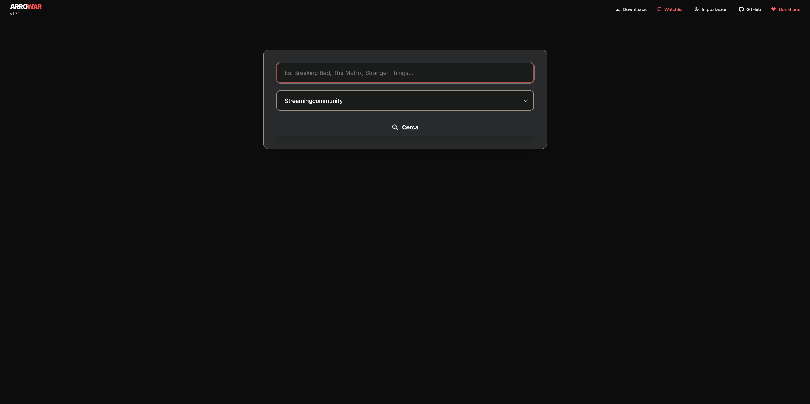

# Web GUI

**🌍 Language / Lingua:** [🇬🇧 English](gui.md) | [🇮🇹 Italiano](../../docs/it/gui.md)

← [Back to main README](../../../README.md)

A web-based interface built with Django for searching and downloading content directly from your browser.



## Quick Start

```bash
pip install -r GUI/requirements.txt
python GUI/manage.py migrate
python GUI/manage.py runserver 0.0.0.0:8000
```

---

## CSRF & Reverse Proxy

When accessing the GUI from outside the local network or behind a reverse proxy, Django may reject requests due to CSRF validation failures. Configure the following environment variables as needed.

### Trusted Origins

Required when requests arrive from a domain or port not matching Django's expected origin:

```
CSRF_TRUSTED_ORIGINS="http://127.0.0.1:8000 https://yourdomain.com"
```

### HTTPS Forwarding

If the reverse proxy terminates SSL/TLS, forward the scheme to Django:

**Apache:**
```apache
RequestHeader set X-Forwarded-Proto "https"
```

**Environment variable:**
```
SECURE_PROXY_SSL_HEADER_ENABLED=true
```

### Recommended Variables for Proxy Deployments

```
ALLOWED_HOSTS="yourdomain.com"
USE_X_FORWARDED_HOST=true
CSRF_COOKIE_SECURE=true
SESSION_COOKIE_SECURE=true
```